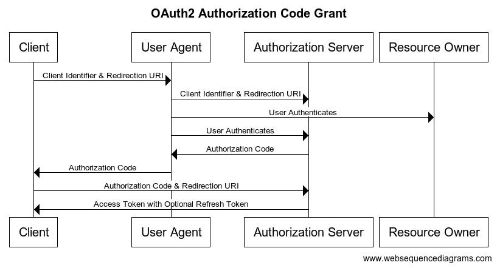
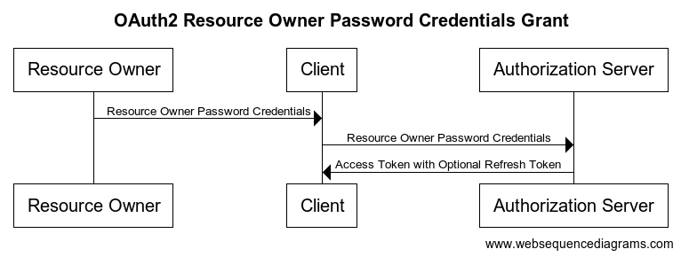
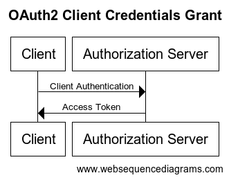
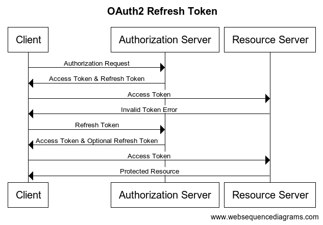

# OAuth 2.0 完全に理解した

https://algas.github.io/oauth2-study/

山内 雅浩
[@algas](https://github.com/algas)

---

# この発表を聞いて分かるようになること

- OAuth 2.0 が怖くなくなる
- OAuth 2.0 をどこでどう使えばいいか把握できる
- RFC 6749 が読めるようになる

---

# 発表概要

1. OAuth 2.0 とは何か
1. RFC 6749 (OAuth2.0) を読む
1. OAuth 2.0 の使い方

---

# OAuth2.0とは何か

---

# OAuth2.0とは何か
## 認証と認可

- 認証: アクセスしたのが誰であるかを確認すること
- 認可: リソースへのアクセス権限を与えること
    - OAuth はこっち
    - 認可自体は認証と関係ない(印鑑や切符は持ってれば誰でも使える)

---

# OAuth2.0とは何か
## 認可の具体例

たとえば、クラウド上の写真データを印刷サービスを使ってプリントしたいとする
でも、写真データにアクセスするパスワードを印刷サービスには教えたくない
パスワードを教えずに印刷サービスが写真データにアクセスさせるために「認可」を使う

---

# OAuth2.0とは何か
## OAuth2.0の概要

- OAuth 2.0 は HTTP サービスへの限定的なアクセスを可能にする認可フレームワークである
- 制限されたリソースにアクセスするためのトークンを取得する方法とそのトークンの使い方を定義したものである

---

# OAuth2.0とは何か
## OAuth 2.0 は何では「ない」か

- OAuth は HTTP プロトコルを使わずに定義されることではない
- OAuth は認証のプロトコルではない
- OAuth ではあるユーザから別のユーザへの権限委譲の中身を定義していない
- OAuth は認可プロセスの仕組みを理解していない
- OAuth は Token のフォーマットを定義していない
- OAuth は暗号に関する方法について定義していない
- OAuth 2.0 は単一のプロトコルではない

引用: [書籍 「OAuth徹底入門」(第1章5節)](https://www.shoeisha.co.jp/book/detail/9784798159294)

--- 

# RFC6749を読む
## RFC6749について

https://datatracker.ietf.org/doc/html/rfc6749

- "The OAuth 2.0 Authorization Framework"
- Internet Engineering Task Force, Requests for Comment 6749
- インターネット技術特別技術委員会による技術文章

--- 

# RFC6749を読む
## Abstract (Page 1)

> OAuth 2.0 は, サードパーティーアプリケーションによるHTTPサービスへの限定的なアクセスを可能にする認可フレームワークである. サードパーティーアプリケーションによるアクセス権の取得には, リソースオーナーとHTTPサービスの間で同意のためのインタラクションを伴う場合もあるが, サードパーティーアプリケーション自身が自らの権限においてアクセスを許可する場合もある. 本仕様書はRFC 5849に記載されているOAuth 1.0 プロトコルを廃止し, その代替となるものである.

引用: https://openid-foundation-japan.github.io/rfc6749.ja.html

---

# RFC6749を読む
## Roles (Page 6)

1. Resource Owner: 認可を渡す役割
ユーザのWebブラウザ
2. Resource Server: 保護されたリソースをホストするサーバ
写真データを持つサーバ
3. Client: 認可をもらう役割
印刷サービス
4. Authorization Server: 認可のためのトークンを発行するサーバ
OAuth のサーバ

---

# RFC6749を読む
## Protocol Flow (Page 7)

3行でわかるプロトコルの流れ

1. Client -> Resource Owner: リソースにアクセスしたいので Grant ください
(Grant をもらう)
2. Client -> Authorization Server: Grant あるので Access Token ください
(Access Token をもらう)
3. Client -> Resource Server: Access Token あるのでリソースください
(リソースをもらう)

---

# RFC6749を読む
## Protocol Flow (Page 7)

---

# RFC6749を読む
## Authorization Grant (Page 8)

4種類のGrant(権限の渡し方)

1. Authorization Code
2. Implicit
3. Resource Owner Password Credentials
4. Client Credentials

---

# RFC6749を読む
## Grant 1: Authorization Code (Page 8,24)

- Access Token と Refresh Token を得る
- Confidential Client 用で Web Browser での操作が要る

---

# RFC6749を読む
## Grant 2: Implicit (Page 8,31)

- Access Token を得る
- Public Client 用で Web Browser の JS で動く

---

# RFC6749を読む
## Grant 3: Resource Owner Password Credentials (Page 9,37)

- Resource Owner の Credentials を使って Access Token を得る

---

# RFC6749を読む
## Grant 4: Client Credentials (Page 9,40)

- Access Token を得る
- Confidential Client のみ

---

# RFC6749を読む
## Access Token (Page 10,43)

制限されたリソースにアクセスするための鍵のようなもの
トークンのフォーマットなどは定義されてない
(あとで書く)

---

# RFC6749を読む
## Refresh Token (Page 10,47)

3行でわかる Refresh Token

1. Client -> Resource Server: Access Token あるのでリソースください
(Token が古いからダメ)
2. Client -> Authorization Server: Refresh Token あるので Access Token ください
(新しい Access Token と Refresh Token もらう)
3. Client -> Resource Server:  Access Token あるのでリソースください (2回目)
(リソースをもらう)

ポイントは Resource Owner が出てこないこと

---

# RFC6749を読む
## Refresh Token (Page 10,47)

---

# RFC6749を読む
## Protocol Entpoints (Page 18)

2つの認可サーバエンドポイント

- Authorization Entpoint (`/authorize`): Client が Resource Owner から認可を得るのに使う
- Token Endpoint (`/token`): Client が Access Token と Grant を交換するために使う

---

# OAuth2.0の使い方

---

# OAuth2.0の使い方
## Roleごとに見たユースケース

1. Resource Owner として OAuth 2.0 を利用する
ユーザとしての利用(消費者側)
1. Resource Server として OAuth 2.0 を利用する
他のサービスに自社のリソースを使ってもらう(受動的)
1. Client として OAuth 2.0 を利用する
他のサービスのリソースを使う
1. Authorization Server として OAuth 2.0 を利用する(能動的)
認可サービスの運用(プラットフォーム側)

---

# OAuth2.0の使い方
## OAuth2.0で提供されてるリソースの例

Clientとして利用する場合に使えるリソース

- github
https://docs.github.com/en/developers/apps/building-oauth-apps/scopes-for-oauth-apps
- slack
https://api.slack.com/scopes

---

# OAuth2.0の使い方
## 認可サーバを実装する

1. Webサービスを使う
    - [Auth0](https://auth0.com/)
1. 認可フレームワークライブラリを使う
    - [Keycloak](https://www.keycloak.org/)
1. 自前で実装する

---

# Enjoy Your Authorization !!

---

# Appendix
## References

- [RFC6749](https://datatracker.ietf.org/doc/html/rfc6749)
- [RFC6749日本語訳(OpenID Foundation Japan)](https://openid-foundation-japan.github.io/rfc6749.ja.html)
- [書籍「OAuth徹底入門 セキュアな認可システムを適用するための原則と実践」](https://www.shoeisha.co.jp/book/detail/9784798159294)
- [GitHub API Document](https://docs.github.com/en/developers/apps/building-oauth-apps/scopes-for-oauth-apps)
- [Slack API Document](https://api.slack.com/scopes)
- [Auth0](https://auth0.com/)
- [Keycloak](https://www.keycloak.org/)
